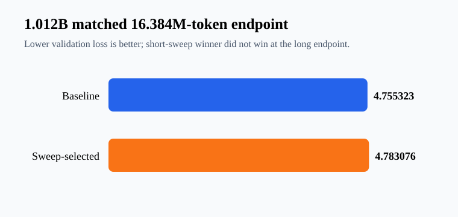

# H200 Pretraining & Optimizer Lab

[](https://github.com/hang154/h200-pretraining-optimizer-lab/actions/workflows/ci.yml)
[](https://github.com/hang154/h200-pretraining-optimizer-lab/releases)

Reproducible evidence from scratch pretraining, optimizer studies, continued
pretraining, and recovery tests on NVIDIA H200 GPUs.

Hugging Face artifacts: [evidence dataset](https://huggingface.co/datasets/hang010412/h200-training-evidence) · [portfolio collection](https://huggingface.co/collections/hang010412/h200-training-and-post-training-portfolio-2026-09-6aba3f860fbd297da8c7fd51)

> This repository is a sanitized public snapshot assembled from preserved run
> artifacts; original experiment timestamps are retained in the manifests.

## Measured results

| Run | Parameters | Optimizer | Tokens | Validation loss | tok/s | Peak HBM GiB |
|---|---:|---|---:|---:|---:|---:|
| checkpoint resume | 405,334,016 | AdamW | 153,600 | 6.957358 | 3,484.7 | 3.33 |
| 1B baseline | 1,011,781,632 | AdamW | 16,384,000 | **4.755323** | 30,990.4 | 8.90 |
| 1B sweep-selected | 1,011,781,632 | AdamW | 16,384,000 | 4.783076 | 31,117.0 | 8.90 |
| 410M AdamW | 405,334,016 | AdamW | 2,457,600 | 5.772677 | 11,060.0 | 3.71 |
| 410M Adafactor | 405,334,016 | Adafactor | 2,457,600 | 11.015334 | 9,217.6 | 2.20 |



The short-budget sweep selected the configuration presented here as
`1B sweep-selected`. At the matched 16.384M-token endpoint it did **not**
outperform the baseline. This is a negative result and evidence that
short-horizon hyperparameter rankings can be unstable.

The equal-learning-rate AdamW/Adafactor run is an operational comparison, not
a fair general optimizer ranking. The CPT loss is measured on a distinct
GSM8K-derived corpus and is not compared directly with pretraining loss.

`train_loss_tail` and `val_loss` use different sampling: the former is the
online mean of the last 20 randomly sampled training windows, while the latter
is a deterministic post-run mean over fixed contiguous validation windows.
The unusually large gap in the preserved long runs is disclosed as an
aggregation/sampling warning; it is not used as a convergence claim.

## Reproduction level

| Experiment | Public reproduction level |
|---|---|
| Synthetic feasibility sweep | Full |
| WikiText-103 public-corpus 1.012B run | Full code/config; compute and dataset download required |
| GSM8K continued pretraining | Full trainer path; checkpoint weights excluded |

The public-corpus path is `scripts/prepare_wikitext.py` →
`scripts/run_public_config.py`, with the two matched configs under `configs/`.

## What is included

- Executed training and sweep scripts.
- Public CSV/JSON summaries and the detailed benchmark report.
- A claim validator that enforces the public naming and negative-result text.
- Checkpoint interruption/resume evidence. A worker resumed from durable step
  50 and completed step 300.

Model weights, checkpoints, raw telemetry, and private infrastructure details
are intentionally excluded.

## Validate

```bash
python scripts/validate_claims.py
python scripts/plot_results.py
python -m py_compile scripts/*.py
```

## Claim boundary

This repository documents bounded experiments and hands-on execution. It does
not claim converged web-scale pretraining or years of production ownership.
